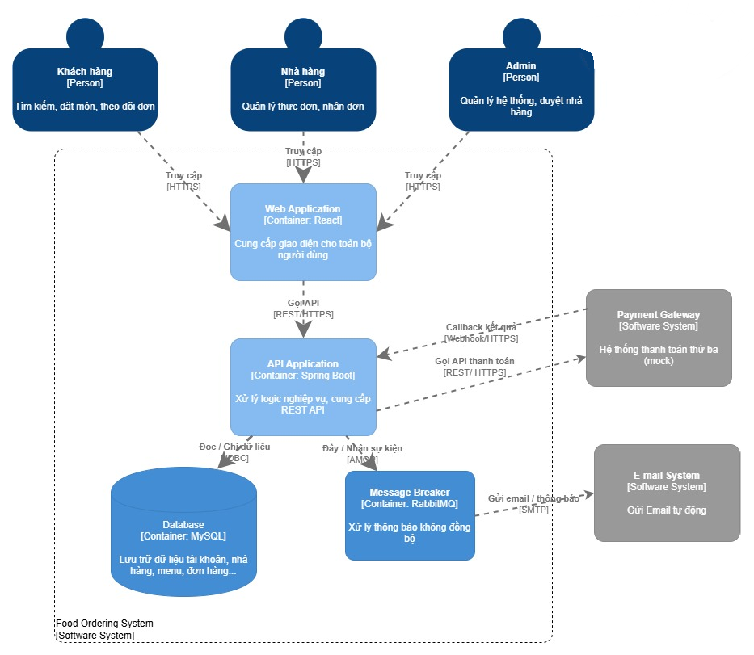

# FOOD ORDERING SYSTEM

## Mô tả
Hệ thống đặt món ăn (Food Ordering System) là một ứng dụng web full-stack được xây dựng bằng Spring Boot, React và MySQL, cung cấp các RESTful API cho việc quản lý thực đơn và xử lý đơn hàng. Hệ thống sử dụng RabbitMQ cho cơ chế nhắn tin bất đồng bộ và được container hóa bằng Docker để hỗ trợ triển khai và vận hành dễ dàng.
## Thành viên nhóm
| MSSV       | Họ tên             | Vai trò                                                                   | 
|------------|--------------------|---------------------------------------------------------------------------| 
| 2351010205 | Trịnh Thị Anh Thư  | Leader, Project Manager, Backend & Frontend Developer cho Module Customer | 
| 2351010214 | Lê Hoàng Bảo Trân  | Backend & Frontend Developer cho Module Admin                             | 
| 2351010036 | Nguyễn Triệu Duy	  | Backend & Frontend Developer cho Module Restaurant                        |

## Tính năng chính (MVP)
- Quản lý nhà hàng và menu
- Ðặt món, giỏ hàng
- Theo dõi trạng thái đơn hàng
- Thanh toán (mock payment)
- Ðánh giá và nhận xét
- Thông báo đơn hàng mới cho nhà hàng

## Công nghệ sử dụng
- Backend: Spring Boot
- Frontend: React
- Database: MySQL
- Message Queue: RabbitMQ
- Container: Docker + Docker Compose

## Kiến trúc
Dự án áp dụng mô hình **Modular Monolith** kết hợp với kiến trúc **Client-Server**, được thiết kế nhằm đảm bảo sự phân tách trách nhiệm (Separation of Concerns), dễ dàng bảo trì và sẵn sàng mở rộng trong tương lai (Future-proof):

* **Frontend (Client - React SPA):** Hệ thống phía người dùng được xây dựng dưới dạng một Single Page Application (SPA) duy nhất bằng **React.js**. Ứng dụng tích hợp cơ chế điều hướng theo quyền (Role-based routing) để cung cấp các không gian làm việc độc lập, bảo mật cho 3 đối tượng người dùng: *Khách hàng*, *Nhà hàng* và *Admin*.
* **Backend (Server - Spring Boot):** Đóng vai trò là trung tâm xử lý dữ liệu, cung cấp các RESTful APIs. Mã nguồn được thiết kế theo **Kiến trúc phân tầng (Layered Architecture)** chuẩn mực:
    * `Controller`: Tiếp nhận request và định tuyến API.
    * `Service`: Xử lý logic nghiệp vụ cốt lõi (Order, Payment, User...).
    * `Repository`: Quản lý giao tiếp với cơ sở dữ liệu.
* **Infrastructure & Integration:** Dữ liệu được lưu trữ tập trung tại **MySQL**. Ngoài ra, hệ thống tích hợp **RabbitMQ** (Message Broker) để xử lý các tác vụ bất đồng bộ (như gửi email, thông báo), giúp tối ưu hóa thời gian phản hồi của API.

## Cài đặt và chạy
### Yêu cầu
- Java 17+
- Node.js 18+
- MySQL
- Docker Desktop
- Git

### Chạy với Docker Compose
git clone https://github.com/thuttat/FOOD-ORDERING-SYSTEM.git

cd FOOD-ORDERING-SYSTEM

docker-compose up -d

### Truy cập
- Frontend: http://localhost:3000
- Backend API: http://localhost:8000
- RabbitMQ Management: http://localhost:15672

## Demo
[Link video demo hoặc screenshots]

## Tài liệu
- [ADRs](docs/adrs/)
- [API Documentation](docs/api/)